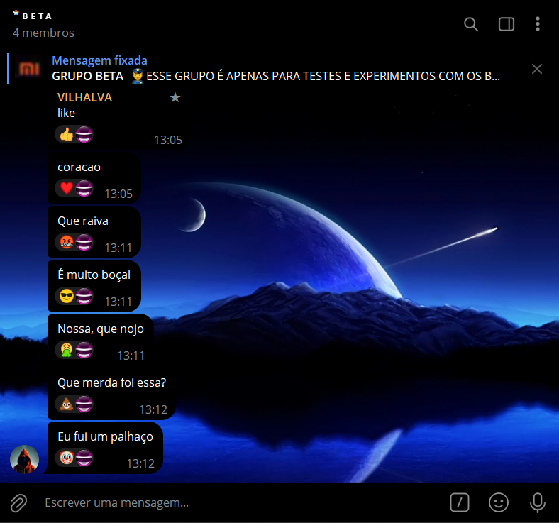
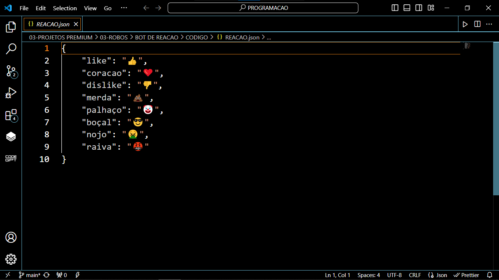

# BOT DE REACAO
🛑ESSE É UM BOT DO TELEGRAM QUE REAJE AUTOMATICAMENTE A UMA PALAVRA CHAVE EM UMA CONVERSA!

 <br>
 <br>

## DESCRIÇÃO:
Este bot é um assistente automatizado para grupos do Telegram que reage a mensagens contendo palavras-chave específicas com emojis correspondentes. 

## RECURSOS:
1. **Reações Automáticas:** O bot monitora todas as mensagens enviadas em grupos do Telegram em que ele está presente.
  
2. **Palavras-chave e Reações Correspondentes:** Ele procura por palavras-chave específicas dentro das mensagens. Quando uma palavra-chave é encontrada, o bot reage à mensagem com um emoji correspondente pré-definido.

3. **Configuração Flexível:** A lista de palavras-chave e reações correspondentes é configurável por meio de um arquivo JSON chamado "REACAO.json".

## AVISO:
Assim como os outros bots só pode enviar uma mensagem por vez em um grupo, ele também só pode reagir uma vez em cada postagem. Se você deseja que um bot reaja múltiplas vezes em uma única postagem, precisará criar e adicionar múltiplos bots ao grupo que rodam esse mesmo código. 

É impossível fazer um único bot reagir mais de uma vez em uma mensagem (nem mesmo um usuário comum pode fazer isso). Esta limitação não é imposta pela API de bots do Telegram, mas sim pelo próprio Telegram.

## PROCEDIMENTO DE COMPRA:
- Para efetuar a compra, por favor, entre em contato comigo por mensagem privada, informando:
    ```bash
    Gostaria de adquirir o bot: https://github.com/VILHALVA/BOT-DE-REACAO
    ```
    
- Após a confirmação do pagamento e o envio do comprovante, você receberá um arquivo zip contendo o código-fonte do bot, acompanhado de um manual detalhado (`MANUAL.md`), que oferece instruções abrangentes sobre a configuração do ambiente, sugestões de cursos e documentação recomendada, bem como o arquivo `HOSPEDAGEM.md`, contendo orientações para hospedar o seu bot.

- [🤑CLIQUE AQUI PARA ENTRAR EM CONTATO](https://t.me/VILHALVA100)
- [🧑‍💻PRECISA DE UM FREELANCER? CLIQUE AQUI PARA VER EM TELEGRAPH](https://telegra.ph/FREELANCER-10-19-9)
- [🧑‍💻PRECISA DE UM FREELANCER? CLIQUE AQUI PARA VER EM README](https://github.com/VILHALVA/VILHALVA/blob/main/FREELANCER/README.md)
